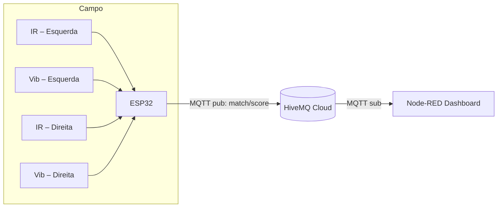

# Detector de Gol IoT — “Passa a Bola”

Sistema IoT que detecta gol com dois sensores por lado (feixe IR + vibração).  
O ESP32 decide o evento e publica, via **MQTT**, o **placar acumulado** no tópico **`match/score`**.  
O Node-RED assina esse tópico e exibe o placar em tempo real.

---

## Integrantes
- Felipe Santos Nunes.  RM563919
- Felipe Souto da Costa Lanna.  RM566578
- Felipe Ramalho Junqueira Berto.  RM562148

---

## Objetivo
Implementar a arquitetura inicial de uma aplicação IoT capaz de coletar e transmitir, em tempo real, o placar de uma partida de futebol de mesa/mini-campo.

---

## Arquitetura


### Lógica de detecção
1. **IR arma** o lado quando detecta passagem da bola (borda HIGH→LOW).
2. **Vibração confirma** o gol se ocorrer em até **300 ms** após o IR.
3. Lockout de **2 s** evita gols duplos.
4. O ESP32 mantém `score_left` e `score_right` e publica:
```json
{"Tigers":2,"Lions":1,"t_ms":123456}
```

---

## Recursos necessários
- **ESP32 DevKit v1** (ou simulação Wokwi)
- 2 sensores **IR break-beam**
- 2 sensores **SW-420** (vibração da rede)
- Broker **HiveMQ Cloud** (MQTT TLS 8883)
- **Node-RED** para dashboard

---

## Como rodar

### 1️⃣ Simulação no Wokwi
1. Abra a pasta `wokwi/` no site **wokwi.com**, clique em **Import Project** e selecione `diagram.json`.
2. No arquivo `firmware/esp32_goal_detector.ino`, edite:
   ```
   const char* MQTT_HOST   = "<seu cluster>.s1.eu.hivemq.cloud";
   const char* MQTT_USER   = "<seu usuário>";
   const char* MQTT_PASSWD = "<sua senha>";
   ```
3. Clique ▶ para iniciar a simulação.  
   O ESP32 conecta-se ao Wi-Fi `Wokwi-GUEST` (sem senha) e publica o placar em `match/score`.
4. No **HiveMQ Web Client** (porta **8884** WebSocket TLS), faça **Subscribe** em `match/score` e veja o placar chegar ao vivo.

### 2️⃣ Dashboard em Node-RED
1. Abra o Node-RED (local ou em servidor) e importe `nodered/flows.json`.
2. Edite o nó **MQTT Broker** com o host/usuário/senha do seu HiveMQ Cloud.
3. Deploy.  
   O dashboard exibirá:
   * **placar em tempo real** (gols esquerda/direita);
   * histórico de gols recebidos.

### 3️⃣ Hardware real (opcional)
1. Monte os sensores:
   * IR-Left → GPIO 18
   * Vib-Left → GPIO 19
   * IR-Right → GPIO 21
   * Vib-Right → GPIO 22
   * LEDs (opcional) → GPIO 25 e 26 com resistores de 220 Ω
2. Compile e carregue `esp32_goal_detector.ino` no seu ESP32.
3. Ligue na mesma rede Wi-Fi configurada e assine `match/score` no HiveMQ Web Client ou no Node-RED.

---

## Tópicos MQTT
- **`match/score`** – placar acumulado:
  ```json
  { "Tigers": N, "Lions": M, "t_ms": 123456 }
  ```
- **`match/status`** – estado online (mensagem retained):
  ```json
  { "online": true }
  ```

---

## Licença
MIT
