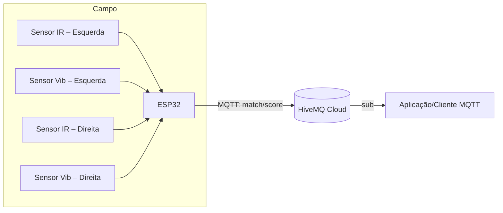

# Arquitetura do Sistema – Detector de Gol IoT

## Visão geral
O sistema detecta gols usando dois sensores por lado (feixe IR e sensor de vibração) conectados a um **ESP32 DevKit v1**.  
Quando um gol é confirmado, o ESP32 publica o **placar acumulado** no tópico MQTT `match/score` hospedado no **HiveMQ Cloud**.

---

## Diagrama de blocos


---

## Pinagem do ESP32
| Função | GPIO |
|--------|-----|
| IR Esquerda | 18 |
| Vibração Esquerda | 19 |
| IR Direita | 21 |
| Vibração Direita | 22 |
| LED indicador Esquerda | 25 |
| LED indicador Direita | 26 |

Todos os sensores utilizam **INPUT_PULLUP** (repouso = HIGH, acionado = LOW).

---

## Fluxo de operação
1. **Armar lado:** quando o feixe IR de um lado é interrompido, esse lado fica “armado” por 300 ms.
2. **Confirmar gol:** se, dentro dessa janela, o sensor de vibração do mesmo lado dispara, um gol é confirmado.
3. **Lockout:** após cada gol, há um bloqueio de 2 s para evitar contagem dupla.
4. **Publicação:** o ESP32 atualiza os contadores `Tigers` e `Lions` e envia:
   ```json
   { "Tigers": N, "Lions": M, "t_ms": 123456 }
   ```
   no tópico `match/score`.
5. **Status online:** também publica em `match/status` a mensagem `{ "online": true }` (retained).

---

## Segurança e Broker
- Broker: **HiveMQ Cloud** com TLS na porta 8883.
- No firmware de demonstração é usado `net.setInsecure()` apenas para testes.
- Em produção recomenda-se carregar o certificado CA do HiveMQ.

---

## Possíveis evoluções
- Adicionar notificação push (ex.: Telegram, FCM) quando o placar mudar.
- Criar dashboard web próprio para exibir o placar em tempo real.
- Persistir histórico de partidas em banco de dados.

---
